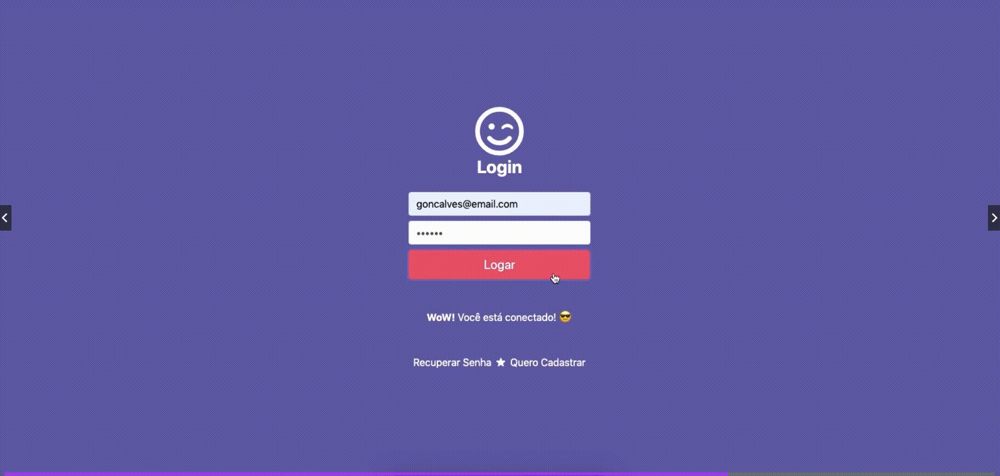

<h1 align="center">
  
</h1>

  <a href="#-tecnologias">Tecnologias</a>&nbsp;&nbsp;&nbsp;|&nbsp;&nbsp;&nbsp;
  <a href="#-projeto">Projeto</a>&nbsp;&nbsp;&nbsp;|&nbsp;&nbsp;&nbsp;
  <a href="#-layout">Layout</a>&nbsp;&nbsp;&nbsp;|&nbsp;&nbsp;&nbsp;
  <a href="#memo-licença">Licença</a>

   
  

 

  

## 🚀 Tecnologias

Esse projeto foi desenvolvido com as seguintes tecnologias:

- React JS
- Firebase
- Bootstrap
- Html
- Css
- JavaScript

## 💻 Projeto

Desenvolvendo um site de publicação de eventos

## 🔖 Layout

Você pode visualizar o layout do projeto através [desse link](#).

## :memo: Licença

Esse projeto está sob a licença MIT. Veja o arquivo [LICENSE](./LICENSE) para mais detalhes.
